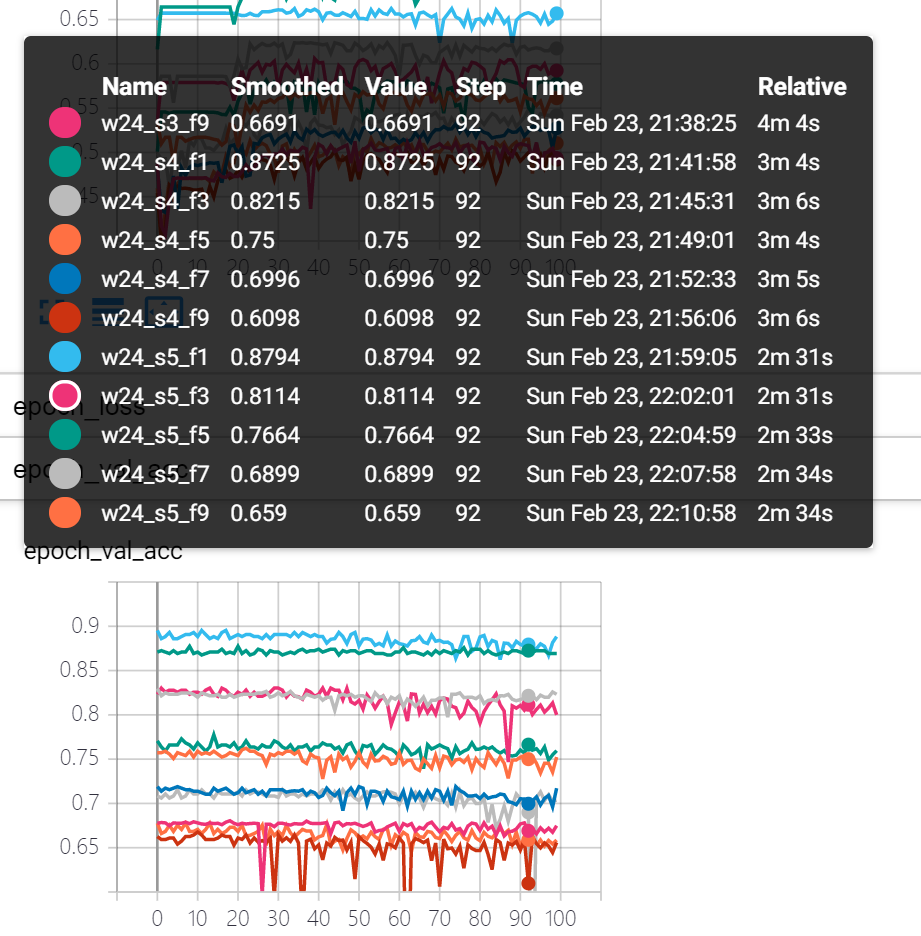
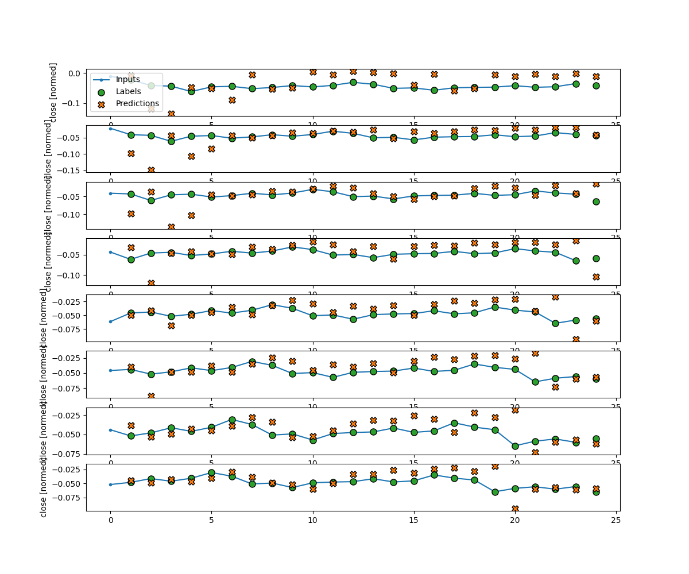

<a name="readme-top"></a>

<div align="center">

[![Contributors][contributors-shield]][contributors-url]
[![Forks][forks-shield]][forks-url]
[![Stargazers][stars-shield]][stars-url]
[![Issues][issues-shield]][issues-url]

</div>

<div align="center">
  <a href="https://github.com/dr413677671/LSTM-stock-price-prediction">
    
  </a>
  <h3 align="center">LSTM-stock-price-prediction</h3>
  <p align="center">
    Stock price predicetion (classification and regression) using LSTM.
    <br />
    <!-- <a href="https://github.com/dr413677671/LSTM-stock-price-prediction/README.md"><strong>Play it »</strong></a> -->
    <br />
    <br />
    <!-- <a href="https://github.com/dr413677671/LSTM-stock-price-prediction/README.md">Explore the docs</a>
    · -->
    <a href="https://github.com/dr413677671/LSTM-stock-price-prediction/issues">Report Bug</a>
    ·
    <a href="https://github.com/dr413677671/LSTM-stock-price-prediction/issues">Request Feature</a>
  </p>
</div>


<!-- TABLE OF CONTENTS -->
<details>
  <summary>Table of Contents</summary>
  <ol>
    <li>
      <a href="#about-the-project">About The Project</a>
      <!-- <ul>
        <li><a href="#built-with">Built With</a></li>
      </ul> -->
    </li>
    <li>
      <a href="#getting-started">Getting Started</a>
        <ul>
        <li><a href="#Prerequisites">Prerequisites</a></li>
        <li><a href="#Installation">Installation</a></li>
        <li><a href="#Usage">Usage</a></li>
      </ul>
    </li>
    <li><a href="#hyper-parameter-search">Hyper-parameter Search</a></li>
    <li><a href="#classification">Classification</a></li>
    <li><a href="#regression">Regression</a></li>
    <li><a href="#acknowledgments">Acknowledgments</a></li>
  </ol>
</details>


<!-- ABOUT THE PROJECT -->

<!-- <div align=center>

</div> -->

## About The Project

Stock price predicetion (classification and regression) using LSTM. Integrated with another homemade light-weight [quant framework](https://github.com/dr413677671/Quantflow-deep-learning-quant-framework). Support Sliding windows, hyper-parameter search, backtesting, Reversing Trade and etc. 

LSTM股票价格预测，调用了另一个[自制框架](https://github.com/dr413677671/Quantflow-deep-learning-quant-framework)。支持滑窗, 超参数搜索, 反向对冲, 回测等。

## Features:
- [x] Model
    - [x] LSTM
    - [x] Seq2seq
    - [x] Resnet50-1D
- [x] Prediction
    - [x] Signal Classification (Buy, Sell, Hold) 信号分类
    - [x] Regression (avg price in next window) 回归
- [x] Backtesting Metrics 回调指标
    - [x] Sharpe 夏普
    - [x] Maximum Drawdown 最大回撤
    - [x] Alpha (regression/annualized) (回归法/年化)
    - [x] Beta (regression/annualized) (回归法/年化)
    - [x] Interval rate of return 平均区间收益率
    - [x] Annualized rate of return (baseline/stretegy) 年化收益率 (基准/策略)
    - [x] backtesting rate of return 策略回测收益率
- [x] others
    - [x] Reversing Trade Support 反向对冲回调策略
    - [x] Sliding Window 滑窗生成器
    - [x] focal_loss
    - [x] class_weighed_sampling 分类权重采样 (抑制类别不均衡)

### Built With

* [![Tensorflow][Tensorflow]][Tensorflow-url]
* [![Keras][Keras]][Keras-url]

## Getting Started


### Prerequisites

> Clone repo.

  ```sh
  git clone https://github.com/dr413677671/LSTM-stock-price-prediction.git
  ```
  
### Installation

  ```sh
  pip install <repo-directory>/requirements.txt
  ```

### Usage

> Prepare raw data in csv format. 

> Run relervant jupyter notebooks, and use pandas.dataframe to read raw_data.

    .
    ├── README.md
    ├── docs 
    ├── Regression                   # Signal Regression 
    ├── hypertune                    # Hyper-parameter tuning
    ├── classification               # Window Classification
    └── lib 
        └── quantflow                # Homemade quant framework 

## Hyper-parameter Search

<div align=left>

</div>

## Classification

<div align=left>

</div>

## Regression

<div align=left>

</div>

## Contact

[](https://github.com/https://github.com/dr413677671) &nbsp;&nbsp; [](https://www.youtube.com/channel/https://www.youtube.com/@randuan9718/videos) &nbsp;&nbsp; [](https://www.zhihu.com/people/kumonoue)  

<p align="right">(<a href="#readme-top">back to top</a>)</p>

<!-- ACKNOWLEDGMENTS -->
## Acknowledgments
Based on these brilliant repos:
* [Seq2seq](https://github.com/google/seq2seq)
* [LSTM](https://www.tensorflow.org/api_docs/python/tf/keras/layers/LSTM)
* Logo genetrared by [Stable-Diffusion](https://github.com/CompVis/stable-diffusion)

<p align="right">(<a href="#readme-top">back to top</a>)</p>

<!-- MARKDOWN LINKS & IMAGES -->
<!-- https://www.markdownguide.org/basic-syntax/#reference-style-links -->
[contributors-shield]: https://img.shields.io/github/contributors/dr413677671/LSTM-stock-price-prediction.svg?style=for-the-badge
[contributors-url]: https://github.com/dr413677671/LSTM-stock-price-prediction/graphs/contributors
[forks-shield]: https://img.shields.io/github/forks/dr413677671/LSTM-stock-price-prediction.svg?style=for-the-badge
[forks-url]: https://github.com/dr413677671/LSTM-stock-price-prediction/network/members
[stars-shield]: https://img.shields.io/github/stars/dr413677671/LSTM-stock-price-prediction.svg?style=for-the-badge
[stars-url]: https://github.com/dr413677671/LSTM-stock-price-prediction/stargazers
[issues-shield]: https://img.shields.io/github/issues/dr413677671/LSTM-stock-price-prediction.svg?style=for-the-badge
[issues-url]: https://github.com/dr413677671/LSTM-stock-price-prediction/issues

[python-img]: https://img.shields.io/badge/Python-FFD43B?style=for-the-badge&logo=python&logoColor=blue
[python-url]: https://www.python.org/
[Tensorflow]: https://img.shields.io/badge/TensorFlow-FF6F00?style=for-the-badge&logo=tensorflow&logoColor=white
[Tensorflow-url]: https://github.com/tensorflow/tensorflow
[Keras]: https://img.shields.io/badge/Keras-FF0000?style=for-the-badge&logo=keras&logoColor=white
[Keras-url]: https://github.com/keras-team/keras


<!-- [product-screenshot]: docs/screenshot.JPG -->
